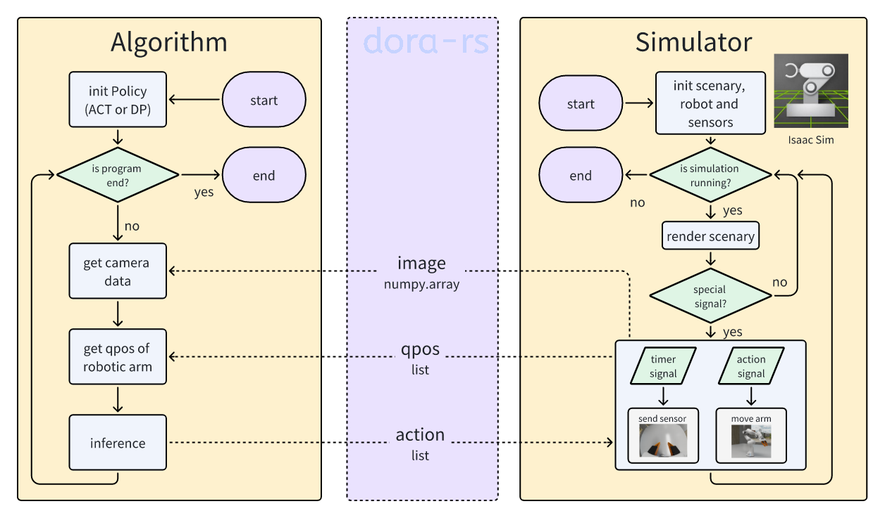

# dora-rs isaacsim



## Preparation

1. Clone this repository;
2. Download model parameters `policy_best.ckpt` and `dataset_stats.pkl` to `node-hub/policy_act/policy_act/assets/ckpt/`
   + Here is an example [act_model](https://drive.google.com/drive/folders/1F1GcguN-Zlrq22FOAqiBiZu6iCwIX6EC?usp=sharing).
3. Download [isaacsim](https://docs.isaacsim.omniverse.nvidia.com/4.5.0/installation/download.html);
4. Download [scenary](https://drive.google.com/drive/folders/1wZEysysqdKG0UYsZLl51Rdi7MFiYbfbP?usp=sharing) and unzip to `node-hub/sim_isaacsim/sim_isaacsim/assets/`

```shell
assets/
├── franka/
├── gripper/
├── Owl/
├── Simple_Room/
└── stack_cube_franka.usd
```

5. Change `ISAAC_PYTHON_PATH` in `graphs/dataflow.yml` to `<path of isaacsim>/python.sh`;
6. Create conda env;

```shell
conda create -n dora_isaacsim python=3.10.4
conda activate dora_isaacsim
pip install -r requirements.txt
```

8. Install necessary packages into isaacsim

```shell
<path of isaacsim>/python.sh -m pip install omegaconf==2.3.0 \
              hydra-core==1.3.2 \
              debugpy \
              h5py==3.13.0 \
              pyparsing==2.4.6 \
              pyyaml==5.3.1 \
              empy==3.3.2 \
              scipy
```

## Getting Started

1. Activate Conda environment

```shell
conda activate dora_isaacsim
```

2. Spawn coordinator and daemon

```shell
dora up
```

3. Start the dataflow

```shell
cd ./graphs
dora build dataflow.yml
dora start dataflow.yml
```

4. Execution example

Click on the Stage > /World/franka and press `F`.

See `./assets/dora_isaacsim_act.mp4`.


1. Close the dora-rs

```shell
dora destroy
```

## YAML Specification

```yaml
nodes:
  - id: sim_isaacsim
    build: pip install -e ../node-hub/sim_isaacsim
    path: ../node-hub/sim_isaacsim/sim_isaacsim/main.py
    env:
      ISAAC_PYTHON_PATH: "<path of isaacsim>/python.sh"
      CONFIG_NAME: "stack_cube_act"
    inputs:
      request_camera: policy_act/request_camera
      request_joint_pos: policy_act/request_joint_pos
      action: policy_act/action
    outputs:
      - camera
      - joint_pos
  
  - id: policy_act
    build: pip install -e ../node-hub/policy_act
    path: ../node-hub/policy_act/policy_act/main.py
    args: 
      --task_name stack_cube
      # path of model parameters (relative to the current dataflow file)
      --ckpt_dir ../node-hub/policy_act/policy_act/assets/ckpt/
      --policy_class ACT
      --kl_weight 10
      --chunk_size 20
      --hidden_dim 512
      --batch_size 8
      --dim_feedforward 3200
      --num_epochs 2000
      --lr 1e-5
      --seed 0
      --temporal_agg
      # --eval
    inputs: 
      camera: sim_isaacsim/camera
      joint_pos: sim_isaacsim/joint_pos
    outputs:
      - request_camera
      - request_joint_pos
      - action
    env:
      SCENARIO: sim
```

## Development

Both of `request_camera` and `request_joint_pos` are requests and have no requirements for data format, and can also be modified to DORA's built-in timer, like `request_*: dora/timer/millis/50`.

`camera` is transmitted as RGB data that is flattened into a one-dimensional array.

Both of `joint_pos` and `action` are pose data of the robotic arm, which is a floating-point list.

